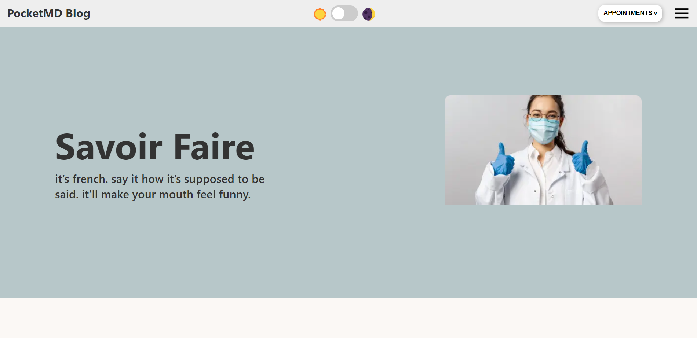

# PocketMD Blog

> PocketMD Blog is a web application that fetches blog articles from API using GraphQL and render them on the screen. The application consist of homepage and details page for the articles.

## Preview:

### Home Page




### Details Page


### DarkMode


### Mobile responsivness


## Built With

- NextJS
- ReactJS
- Typescript
- Styled Components
- Apollo GraphQL

## Standards
- ESLint
- Prettier


## Live version

[PocketMD Blog](https://book-appointments-frontend.netlify.app)

## Getting Started

To get a local copy up and running follow these simple example steps.

### Prerequisites
- A text editor(preferably Visual Studio Code)
- Node
- Web browser

### Install
- [Git](https://git-scm.com/downloads)
- [Node](https://nodejs.org/en/download/)

### Using it Locally

- Clone the project

```bash 
git clone git@github.com:thecodechaser/pocketmd-blog.git

cd pocketmd-blog
```

- Install dependencies

```bash
npm install
yarn install
```
- To Start the development server
```bash
npm run dev
```


## Visit And Open Files

[Visit Repo](https://github.com/thecodechaser/pocketmd-blog)

## Download Repo

[Download Repo](https://github.com/thecodechaser/pocketmd-blog/archive/refs/heads/dev.zip)

## Authors

👤 **Ranjeet Singh**

- GitHub: [@thecodechaser](https://github.com/thecodechaser)
- Twitter: [@thecodechaser](https://twitter.com/thecodechaser)
- LinkedIn: [thecodechaser](https://linkedin.com/in/thecodechaser)


## 🤝 Contributing

Contributions, issues, and feature requests are welcome!

Feel free to check the [issues page](https://github.com/thecodechaser/pocketmd-blog/issues).

## Show your support

Give a ⭐️ if you like this project!

## Acknowledgments

- [PocketMD](https://pocketmd.ca)

## 📝 License

This project is [MIT](./LICENSE.md) licensed.
